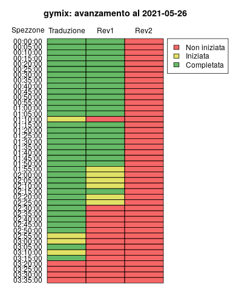

# lbav2 [](https://travis-ci.org/lbraglia/lbav2)

Here you can find the R code I use to manage the process/team involved
in Italian subtitles creation for loong [YouTube
videos](https://youtube.com/anonymousforthevoiceless) (in case it
could be useful for someone else). Our first subbed video was [this
one](https://www.youtube.com/watch?v=cJ9kGZMbyVw); we're now
completing [Gary's mix](https://www.youtube.com/watch?v=3gLOVtbG6QI).

BTW just note that once uploaded the italian version, automatic
generated subs in your language should be available (Settings ->
Subtitles -> Automatic translation): like we say here "piutost che
gnint, l'è mei piutost!"  which is freely translated to "something,
even small, is better than nothing".

Here is the background machinery, the repository with the subs
themselves is [here](https://github.com/lbraglia/av_it_subs).

## Usage

If you want to make your own subs have some programming skill and want
to reuse our software, after installing this package on a Unix
operating system open R in the subs directory (for me it's the clone
of [this](https://github.com/lbraglia/av_it_subs) repo on my machine),
then

```R
prj <- lbav2::prj$new(id = 'gymix', yt_id = 'lw53nODhRXU')
prj$menu()

```

where `gymix` is the project id (which maps to the directory under
`subs`), while `lw53nODhRXU` is the YouTube id of the support video
used for translations. After commanding `menu`, an interactive menu is
given:

```
=========================
        MAIN MENU        
=========================

Select a number or 0 to exit 

1. Setup
2. Create sandboxes
3. Assign TRN or REV2
4. Mark progresses
5. Monitoring
6. List available REV1
7. List available REV2
8. Make final srt
9. Final SRT stats
10. List assignee
11. List users 

Selection (0 to exit): 

```

where:

1. Setup: create the project directory under `subs` and split a source sub
   (derived from YT automatic sub generator) into 5min length chunks
   
2. Create sandboxes: set up test files for translator and revisors

3. Assign TRN or REV2: assign a chunk to be translated or revised
   (readability revision)

4. Mark progresses: update progress information for monitoring
   purposes (eg which translation are completed, which revision are
   started, completed and so on)

5. Monitoring: make a graph such as ...

	

6. List available REV1: list files translated but not linguistically
   revised yet

7. List available REV2: list files linguistically revised but not from
   a readability standpoint yet

8. Make final srt: compose the final `.srt` by collapsing revised
   files

9. Final SRT stats: compute the readability stats for the final `.srt` in
   order to spot subs which are difficult to read

10. List assignee: list all chunks and assigned translator/revisors
    for each of them

11. List users: list all the users in the `data/users.csv` "database"


## Future directions

Port it to Python [here](https://github.com/av-italia/pyavsubs) and
make it less Unix (now some parts need `cat` and `/tmp` directory) and command
line oriented.
